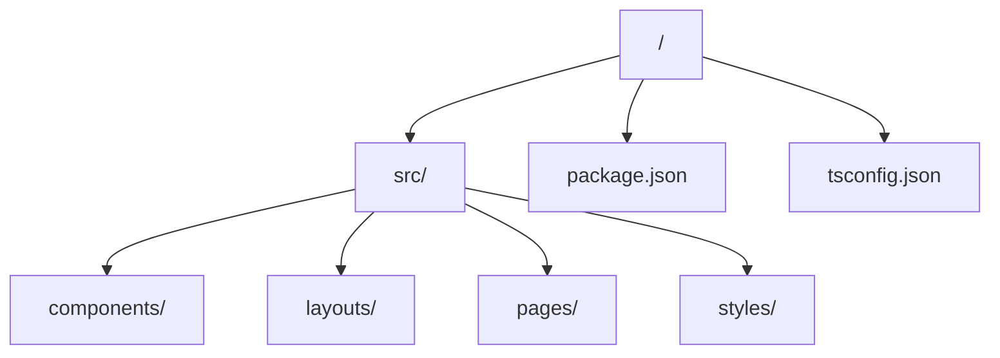

# Portfolio EAnathos

Portfolio personnel construit avec **[Astro](https://docs.astro.build/)** et **[Tailwind CSS](https://tailwindcss.com/docs/)**. Le site presente mes projets, competences, et une section photo.

## Apercu

- Site one-page avec sections A propos, Competences, Projets, Photo, Contact.
- Hero et cartes personnalisees dans un theme spatial bleu.

## Structure du projet

## Commandes

Toutes les commandes se lancent a la racine du projet :

| Commande         | Action                                |
| :--------------- | :------------------------------------ |
| `npm install`    | Installe les dependances              |
| `npm run dev`    | Lance le serveur local (localhost:4321) |
| `npm run build`  | Genere le build de production         |
| `npm run preview`| Previsualise le build                 |
